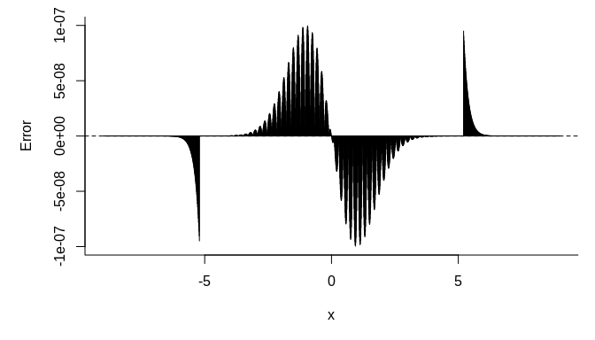
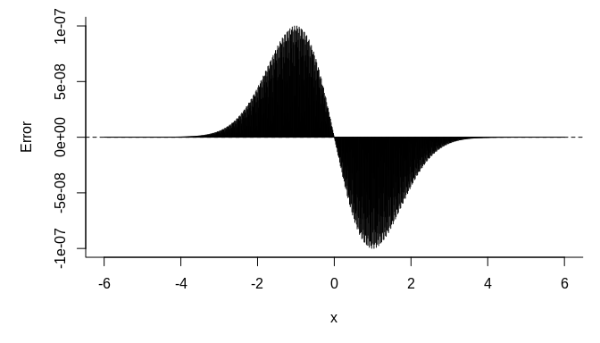

Fast Normal CDF
================

### Introduction

The standard normal CDF
") is an important function in a broad range of statistical
problems. When we need to evaluate the function many times (for example
in numerical integration), the computation performance may become an
issue.

One way to fast evaluate the function is to use a look-up table, that
is, we pre-compute a set of pairs )")\` and then use interpolation to approximate the
function value of a given .

This simple library calculates the
") function using piecewise linear interpolation. The
approximation error is guaranteed to be no greater than .

### Installation

The package can be installed from Github by calling:

``` r
remotes::install_github("boennecd/fastncdf")
```

### Algorithm

We need to first determine the knots
 that we want to
pre-compute. Since  = 1 - \\Phi(x)"), we only need to consider non-negative
’s.

For  = 5.1993376"), we set  = 1") and hence the error is bounded by
. Let ,
, , where  is the smallest integer such that . Then we need to determine the interval width
 to satisfy the error
bound.

For piecewise linear interpolation, the error is bounded by

  
 \\leq 1/8 \\cdot \\lVert f''\\rVert_{\\infty}h^2")  

(Source
<http://pages.cs.wisc.edu/~amos/412/lecture-notes/lecture09.pdf>)

Since  = \\phi'(x) = -x \\phi(x)"), it can be shown that  = 0.2419707").

Therefore  can be
calculated as:

``` r
(h <- sqrt(8 / dnorm(1) * 1e-7))
```

    ## [1] 0.001818292

So the s and
s values are:

``` r
x <- seq(0, qnorm(1 - 1e-7) + h, by = h)
length(x)
```

    ## [1] 2861

``` r
y <- pnorm(x)
```

We can then call `dput(x)` and `dput(y)` to get the data we need.

### Performance

We compare the speed of `fastpnorm()` and `fastpnorm_preallocated()`
with `pnorm()` in R:

``` r
library(fastncdf)
x <- seq(-6, 6, by = 1e-6)
system.time(y <- pnorm(x))
```

    ##    user  system elapsed 
    ##   0.502   0.012   0.515

``` r
system.time(fasty <- fastpnorm(x))
```

    ##    user  system elapsed 
    ##   0.034   0.023   0.057

``` r
system.time(fasty_prec <- fastpnorm(x, TRUE))
```

    ##    user  system elapsed 
    ##   0.124   0.016   0.139

``` r
range(y - fasty)
```

    ## [1] -9.99999e-08  9.99999e-08

``` r
range(y - fasty_prec)
```

    ## [1] -9.99999e-08  9.99999e-08

``` r
# if we already had a vector with values then we can use a faster version
res <- rep(0., length(x))
system.time(fastpnorm_preallocated(x, res))
```

    ##    user  system elapsed 
    ##   0.028   0.000   0.028

``` r
all.equal(res, fasty)
```

    ## [1] TRUE

We plot the error versus the quantile below:

``` r
par(mar = c(5, 5, 1, 1))
xs <- seq(-6, 6, length.out = 2000)
plot(xs, fastpnorm(xs) - pnorm(xs), type = "h",
     bty = "l", xlab = expression(x), ylab = "Error")
abline(h = 0, lty = 2)
```

<!-- -->

``` r
plot(xs, fastpnorm(xs, TRUE) - pnorm(xs), type = "h",
     bty = "l", xlab = expression(x), ylab = "Error")
abline(h = 0, lty = 2)
```

<!-- -->
