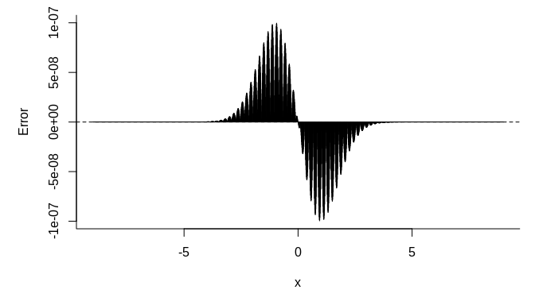

Fast Normal CDF
================

### Introduction

The standard normal CDF
") is an important function in a broad range of statistical
problems. When we need to evaluate the function many times (for example
in numerical integration), the computation performance may become an
issue.

One way to fast evaluate the function is to use a look-up table, that
is, we pre-compute a set of pairs )")\` and then use interpolation to approximate the
function value of a given .

This simple library calculates the
") function using piecewise linear interpolation. The
approximation error is guaranteed to be no greater than .

### Installation

The package can be installed from Github by calling:

``` r
remotes::install_github("boennecd/fastncdf")
```

### Algorithm

We need to first determine the knots
 that we want to
pre-compute. Since  = 1 - \\Phi(x)"), we only need to consider non-negative
’s.

For  = 5.1993376"), we set  = 1") and hence the error is bounded by
. Let ,
, , where  is the smallest integer such that . Then we need to determine the interval width
 to satisfy the error
bound.

For piecewise linear interpolation, the error is bounded by

  
 \\leq 1/8 \\cdot \\lVert f''\\rVert_{\\infty}h^2")  

(Source
<http://pages.cs.wisc.edu/~amos/412/lecture-notes/lecture09.pdf>)

Since  = \\phi'(x) = -x \\phi(x)"), it can be shown that  = 0.2419707").

Therefore,  can be
calculated as:

``` r
(h <- sqrt(8 / dnorm(1) * 1e-7))
```

    ## [1] 0.001818292

So the s and
s values are:

``` r
x <- seq(0, qnorm(1 - 1e-7) + h, by = h)
length(x)
```

    ## [1] 2861

``` r
y <- pnorm(x)
```

We can then call `dput(x)` and `dput(y)` to get the data we need.

### Performance

We compare the speed of `fastpnorm()` and `fastpnorm_preallocated()`
with `pnorm()` in R:

``` r
library(fastncdf)
u <- seq(-6, 6, by = 1e-6)
system.time(truth <- pnorm(u))
```

    ##    user  system elapsed 
    ##   0.487   0.028   0.516

``` r
system.time(fasty <- fastpnorm(u))
```

    ##    user  system elapsed 
    ##   0.041   0.020   0.060

``` r
system.time(fasty_prec <- fastpnorm(u, TRUE))
```

    ##    user  system elapsed 
    ##   0.130   0.016   0.146

``` r
range(truth - fasty)
```

    ## [1] -9.99999e-08  9.99999e-08

``` r
range(truth - fasty_prec)
```

    ## [1] -9.99999e-08  9.99999e-08

``` r
# if we already had a vector with values then we can use a faster version
res <- rep(0., length(u))
system.time(fastpnorm_preallocated(u, res))
```

    ##    user  system elapsed 
    ##    0.03    0.00    0.03

``` r
all.equal(res, fasty)
```

    ## [1] TRUE

We plot the error versus the quantile below:

``` r
par(mar = c(5, 5, 1, 1))
us <- seq(-9, 9, length.out = 2000)
plot(us, fastpnorm(us) - pnorm(us), type = "h",
     bty = "l", xlab = expression(x), ylab = "Error")
abline(h = 0, lty = 2)
```

<!-- -->

``` r
plot(us, fastpnorm(us, TRUE) - pnorm(us), type = "h",
     bty = "l", xlab = expression(x), ylab = "Error")
abline(h = 0, lty = 2)
```

<!-- -->

### Other Interpolation Methods

We can get a similar result using R’s `approxfun` to do linear
interpolation:

``` r
lin_aprx <- local({
  f <- approxfun(x = x, y = y, yleft = 0.5, yright = 1)
  function(x){
    p <- f(abs(x))
    ifelse(x < 0, 1 - p, p)
  }
})

max(abs(lin_aprx(u) - fastpnorm(u)))
```

    ## [1] 1.554312e-15

The R version is slower though:

``` r
system.time(lin_aprx(u))
```

    ##    user  system elapsed 
    ##   0.475   0.156   0.631

``` r
system.time(fastpnorm(u))
```

    ##    user  system elapsed 
    ##   0.032   0.028   0.060

We can though use R’s `splinefun` to see the performance of other
functions. In particular, we can consider monotone cubic interpolation
using Fritsch–Carlson method:

``` r
m_splin <- local({
  n_points <- 300L
  eps <- 1e-9
  x <- seq(0, qnorm(1 - eps), length.out = n_points)
  f <- splinefun(x = x, y = pnorm(x), method = "monoH.FC")
  x_max <- max(x)
  
  function(x){
    p <- f(abs(x))
    out <- ifelse(x < 0, 1 - p, p)
    ifelse(abs(x) > x_max, .5 * (1 + sign(x)), out)
  }
})

# check the error 
range(truth - m_splin(u))
```

    ## [1] -5.165321e-08  5.165321e-08

``` r
# plot the error
plot(us, m_splin(us) - pnorm(us), type = "h",
     bty = "l", xlab = expression(x), ylab = "Error")
```

<!-- -->

We will require three doubles per knot unlike the two we need for the
linear interpolation. Furthermore, more computation is needed to perform
the interpolation. However, we may need much fewer knots as shown above
and this will reduce the cache misses.

A C++ implementation is also provided with this package:

``` r
all.equal(m_splin(u), fastpnorm(u, use_cubic = TRUE))
```

    ## [1] TRUE

``` r
system.time(aprx_cubic <- fastpnorm(u, use_cubic = TRUE))
```

    ##    user  system elapsed 
    ##   0.076   0.024   0.101

``` r
max(abs(aprx_cubic - truth))
```

    ## [1] 5.165321e-08

``` r
res <- rep(0., length(u))
system.time(fastpnorm_preallocated(u, res, use_cubic = TRUE))
```

    ##    user  system elapsed 
    ##   0.073   0.000   0.073

``` r
all.equal(res, aprx_cubic)
```

    ## [1] TRUE

We can compare the monotone cubic interpolation with the linear
interpolation with a particular focus on how well they scale in the
number of threads used in the computation:

``` r
res <- rep(0, length(u))
test_func <- function(use_cubic, n_threads)
  fastpnorm_preallocated(u, res, n_threads = n_threads, 
                         use_cubic = use_cubic)

bench::mark(
  `pnorm             ` = pnorm(u),
  `linear (1 thread) ` = test_func(FALSE, 1L),
  `linear (2 threads)` = test_func(FALSE, 2L),
  `linear (4 threads)` = test_func(FALSE, 4L),
  `linear (6 threads)` = test_func(FALSE, 6L),
  `cubic  (1 thread) ` = test_func(TRUE , 1L),
  `cubic  (2 threads)` = test_func(TRUE , 2L),
  `cubic  (4 threads)` = test_func(TRUE , 4L),
  `cubic  (6 threads)` = test_func(TRUE , 6L),
  check = FALSE, min_time = 2)
```

    ## # A tibble: 9 x 6
    ##   expression              min   median `itr/sec` mem_alloc `gc/sec`
    ##   <bch:expr>         <bch:tm> <bch:tm>     <dbl> <bch:byt>    <dbl>
    ## 1 pnorm               508.7ms  519.2ms      1.92    91.6MB        0
    ## 2 linear (1 thread)    29.2ms   30.3ms     32.8         0B        0
    ## 3 linear (2 threads)     18ms     19ms     51.7    668.5KB        0
    ## 4 linear (4 threads)   17.7ms     19ms     52.1         0B        0
    ## 5 linear (6 threads)   17.9ms   18.9ms     51.6         0B        0
    ## 6 cubic  (1 thread)    68.9ms   69.6ms     14.2         0B        0
    ## 7 cubic  (2 threads)   35.3ms   35.7ms     27.5         0B        0
    ## 8 cubic  (4 threads)   18.7ms   20.2ms     49.0         0B        0
    ## 9 cubic  (6 threads)   18.2ms     19ms     52.0         0B        0

We may prefer the monotone cubic interpolation given the lower error,
lower memory requirements, it scales better in the number of threads,
and it has less “sided” errors.
